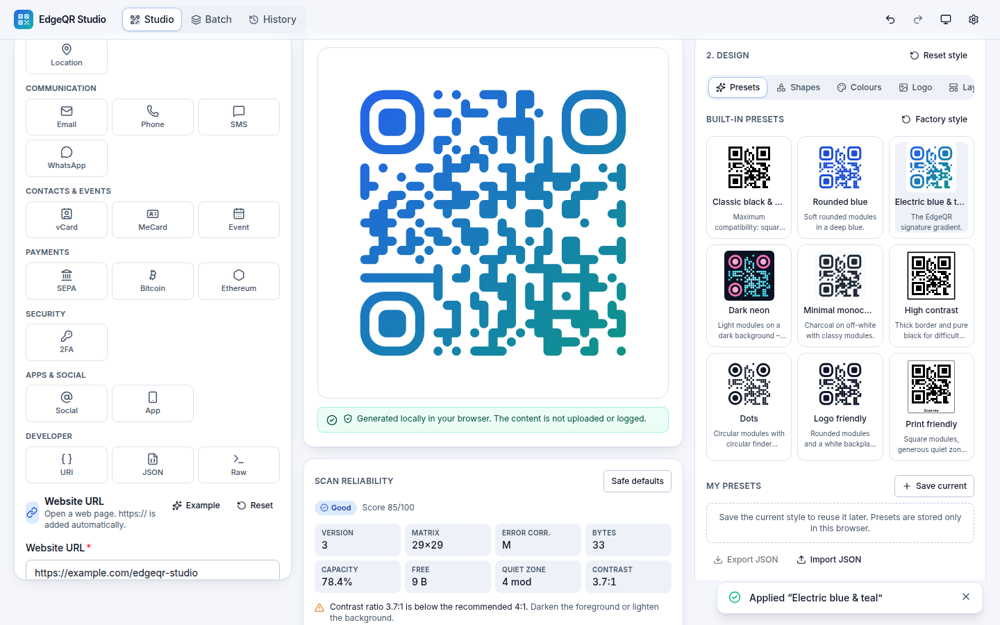
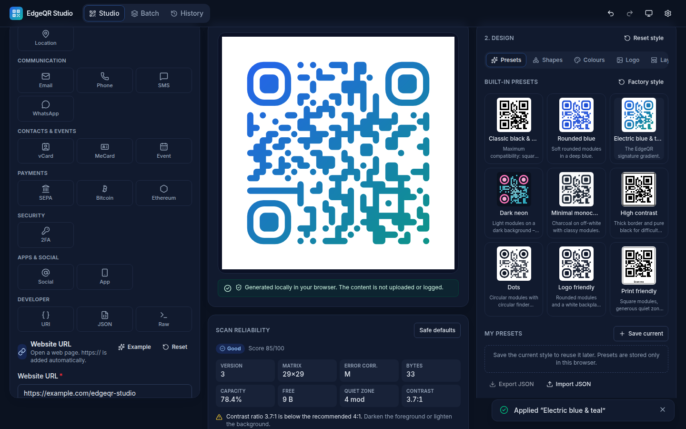
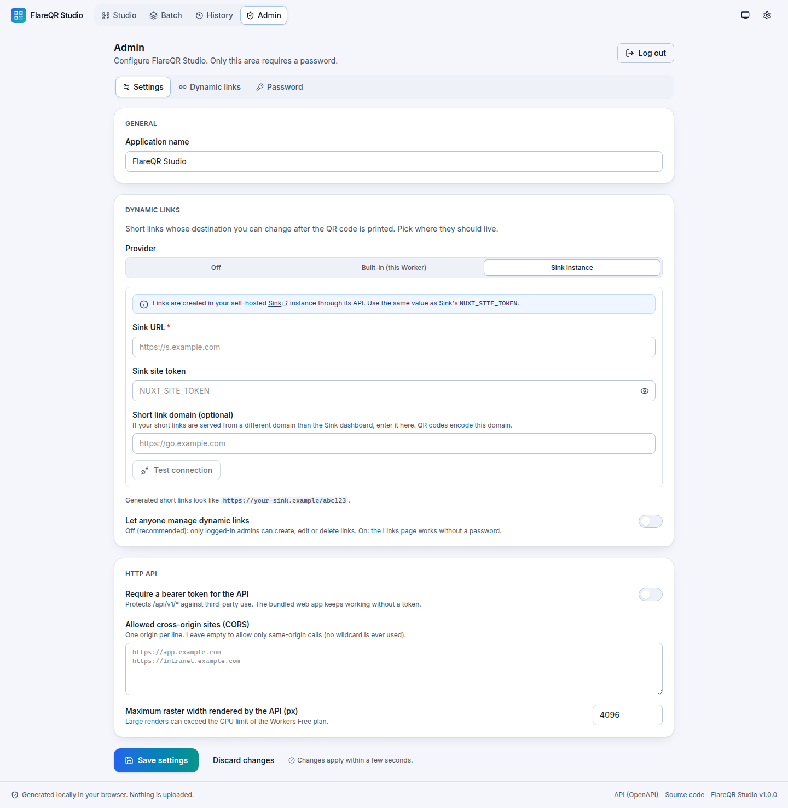
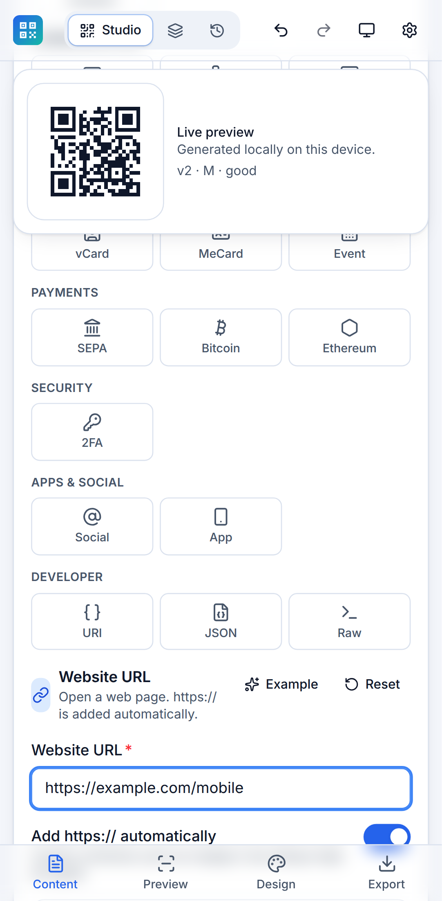
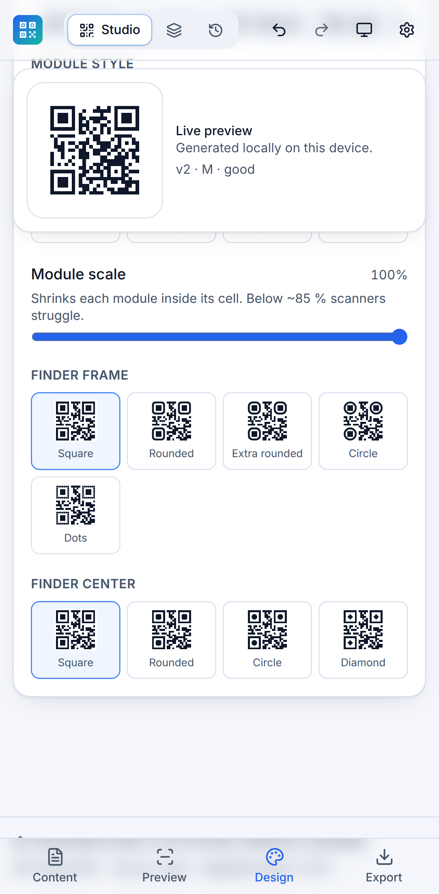
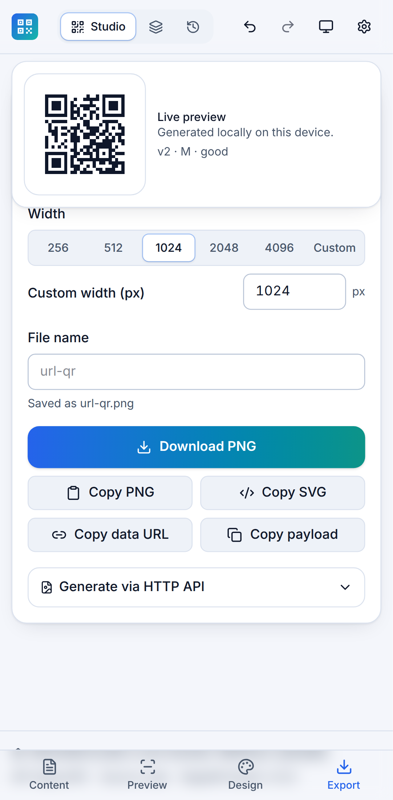

# FlareQR Studio

**A self-hosted, privacy-first QR code studio that runs entirely on Cloudflare Workers.**
Design richly styled, standards-compliant QR codes for 20 content types, export them as SVG, PNG or JPG, generate hundreds at once from a CSV, create editable **dynamic links** (built in or through your own [Sink](https://github.com/miantiao-me/sink) instance) and automate everything through a documented HTTP API – all from a single Worker deployment configured through a password-protected admin page.

[](https://deploy.workers.cloudflare.com/?url=https://github.com/reichiClaw/QRflare)

> **Setup in three steps:** click the button → open your new site → open **Admin** and choose a password. That is all. No account IDs, API tokens, secrets or manual database creation – the one D1 database the app uses is provisioned automatically and every other option lives in the Admin area.

<p align="center">
  
  
</p>
<p align="center">
  
  
  
  
</p>

---

## Table of contents

- [Features](#features)
- [Privacy model](#privacy-model)
- [Quick start](#quick-start)
- [Admin area & settings](#admin-area--settings)
- [Dynamic links](#dynamic-links)
- [Supported content types](#supported-content-types)
- [Output formats](#output-formats)
- [Local development](#local-development)
- [Deploying to Cloudflare](#deploying-to-cloudflare)
- [Custom domain](#custom-domain)
- [HTTP API](#http-api)
- [Batch generation (CSV)](#batch-generation-csv)
- [Configuration reference](#configuration-reference)
- [Security](#security)
- [Browser compatibility](#browser-compatibility)
- [Troubleshooting](#troubleshooting)
- [Customising](#customising)
- [Updating dependencies](#updating-dependencies)
- [Architecture](#architecture)
- [License](#license)

## Features

**Encoding**

- QR Code Model 2, versions 1–40, error correction L/M/Q/H, automatic or manual version and mask selection.
- Numeric, alphanumeric and byte (UTF-8) modes with automatic segmentation; full Unicode and emoji support.
- Capacity validation with clear messages; deterministic output; quiet zone of 4 modules by default.
- Powered by the [Project Nayuki](https://www.nayuki.io/page/qr-code-generator-library) reference encoder (MIT).

**Design**

- Module styles: square, rounded, dots, extra-rounded, diamond, classy, classy-rounded, and a safe custom style (corner radius + connected modules) that never alters the matrix.
- Finder-pattern frames (square, rounded, extra-rounded, circle, dots) and centers (square, rounded, circle, diamond).
- Foreground/background colours (hex, RGB or visual picker), transparent background, separate finder colours, linear/radial gradients with up to six stops.
- Logo upload (PNG, JPG, WebP, sanitized SVG) with scale, padding, corner radius, backplate and module clearing. Logos never cover finder patterns.
- Layout: module scale, quiet zone, padding, border, frame band, caption with font size/weight/alignment/spacing.
- Nine built-in presets plus local custom presets (save, rename, delete, import/export JSON, restore defaults).

**Quality & safety**

- A **Scan reliability** panel reports version, matrix size, error correction, bytes, remaining capacity, quiet zone, contrast and an overall status (Excellent / Good / Risky / Invalid), with actionable warnings.
- One-click **Safe defaults**. Invalid codes can never be exported.

**Export**

- SVG (true vector, self-contained, embedded logo), PNG (128–4096 px, transparency) and JPG (adjustable quality, transparency flattened onto a chosen colour).
- Copy PNG to clipboard, copy SVG source, copy data URL, copy payload; sanitized file names whose extension always matches the real encoding.
- Batch mode: CSV import, row-level validation with inline fixes, chunked generation in a Web Worker, cancellation, ZIP download with optional `manifest.json`.

**Dynamic links & administration**

- Editable short links: destination, label, expiry, on/off switch and scan limits (built-in provider) – reprint nothing when the target changes.
- Two providers: **built in** (D1 in this Worker, privacy-preserving aggregate counters) or a **Sink instance** you already run, optionally with a separate short-link domain.
- Password-protected **Admin** area with all settings in the UI: app name, dynamic-link provider, link domain, Sink connection (with a connection test), API token, CORS allowlist, raster limit, public/admin-only link management.

**Platform**

- React 19 + TypeScript (strict) + Vite 8 + Tailwind CSS 4 frontend, served as Cloudflare Static Assets.
- TypeScript Worker API with real server-side rasterization (resvg WebAssembly + a pure TypeScript JPEG encoder).
- Installable PWA with offline support for the static generator (API responses are never cached).
- Dark, light and system themes; keyboard accessible; WCAG 2.2 AA targets; reduced-motion aware.

## Privacy model

- **Generation is local.** The editor validates, encodes and renders every QR code in your browser. Nothing you type is sent anywhere, and the UI says so explicitly.
- **The API is opt-in.** Only two actions transmit content to _your_ Worker: the "Render raster files via API" toggle in batch mode and any request you send to `/api/v1/*` yourself. Creating a dynamic link naturally sends its destination URL to your Worker (or your Sink instance).
- **No logging of payloads.** The Worker logs method, path, status and duration – never bodies, payloads, secrets or tokens. Error responses never echo payloads.
- **No third parties.** No analytics, tracking pixels, external fonts, CDNs or cookies. The Content Security Policy blocks any accidental external request.
- **History is off by default.** The optional local history stores full designs in `localStorage` only after you enable it, warns that it may contain sensitive data, and can be cleared instantly.
- **Dynamic-link statistics are aggregate only.** The built-in provider stores per-link totals and per-day counts – no IP addresses, user agents, referrers, cookies or fingerprints.

## Quick start

1. Click **Deploy to Cloudflare** above and follow the prompts (Cloudflare forks the repository into your GitHub/GitLab account and builds it with Workers Builds).
2. Open `https://flareqr-studio.<your-subdomain>.workers.dev`.
3. Click **Admin** in the header, choose an admin password, and configure whatever you need – or simply start generating codes; the studio works without touching the admin area.

Prefer the command line?

```bash
git clone https://github.com/reichiClaw/QRflare.git && cd QRflare
npm ci
npx wrangler login
npm run deploy          # builds, provisions the D1 database, deploys
```

## Admin area & settings

Only the **Admin** page requires a password; the generator, batch mode, history and API stay public (the API can optionally require a token).

- **First run:** the first person to open Admin sets the password (minimum 10 characters). Set the `ADMIN_PASSWORD` secret instead if you want to define it before anyone can reach the site.
- **Sessions:** logging in issues a signed 12-hour session kept in the tab's `sessionStorage`. Login attempts are rate limited.
- **Password:** change it in Admin → Password (unless it comes from `ADMIN_PASSWORD`).

Settings available in the UI (stored in the auto-provisioned D1 database):

| Section       | Setting                                      | Effect                                                                                          |
| ------------- | -------------------------------------------- | ----------------------------------------------------------------------------------------------- |
| General       | Application name                             | Header, footer, page title, `/api/health`                                                       |
| Dynamic links | Provider: Off / Built-in / Sink              | Where short links live (see [Dynamic links](#dynamic-links))                                    |
|               | Public link domain (built-in)                | Domain encoded in QR codes, e.g. `https://qr.example.com` when you use a custom domain          |
|               | Sink URL, Sink site token, Short link domain | Connection to your Sink instance and the domain its short links use; **Test connection** button |
|               | Let anyone manage dynamic links              | Off (default): admin login required. On: the Links page works for everyone                      |
| HTTP API      | Require a bearer token + token (Generate)    | Protects `/api/v1/*`; the bundled UI keeps working without a token                              |
|               | Allowed cross-origin sites (CORS)            | Explicit allowlist; never `*`                                                                   |
|               | Maximum raster width                         | Upper bound for API PNG/JPEG renders                                                            |

Environment variables (`APP_NAME`, `API_TOKEN`, `CORS_ALLOWED_ORIGINS`, `MAX_RASTER_SIZE`) act as defaults; values saved in Admin override them. Secrets are never sent back to the browser – the UI only shows whether one is stored.

## Dynamic links

A dynamic QR code encodes a short URL that redirects to a destination you can change later. Enable it under **Admin → Settings → Dynamic links**:

### Built-in provider

- Links are stored in this Worker's D1 database and served from `/r/<code>` with a `302` redirect.
- Per link: destination, label, enable/disable, expiry date, maximum scans, aggregate scan count and per-day counts.
- If your Worker is reachable under a custom domain, enter it as **Public link domain** so QR codes encode `https://qr.example.com/r/<code>` instead of the `workers.dev` URL.

### Sink provider

If you already run [Sink](https://github.com/miantiao-me/sink), let FlareQR Studio create links there:

1. Enter the **Sink URL** (where its dashboard lives, e.g. `https://s.example.com`).
2. Enter the **Sink site token** – the value of Sink's `NUXT_SITE_TOKEN`.
3. If your short links are served from a different domain than the dashboard, enter it as **Short link domain** (e.g. `https://go.example.com`). QR codes encode `https://go.example.com/<slug>`.
4. Click **Test connection**, then **Save settings**.

FlareQR Studio then proxies create/list/edit/delete to Sink's API (`/api/link/*`), shows Sink's dashboard link for statistics, and never stores link data itself. Sink returns HTTP 423 until its storage has been initialised once from its own dashboard; the UI surfaces that message.

### Using a link

Open **Admin → Dynamic links** (or the public **Links** page when you allow public management), create a link, click **Use in studio** – the short URL is loaded into the URL editor, ready to style and export.

Full guide: [`docs/dynamic-links.md`](docs/dynamic-links.md).

## Supported content types

| Type               | Payload format                                       | Notes                                                                                      |
| ------------------ | ---------------------------------------------------- | ------------------------------------------------------------------------------------------ |
| Plain text         | raw text                                             | Live character and byte counter, Unicode/emoji                                             |
| Website URL        | `https://…`                                          | Automatic `https://`, custom schemes preserved                                             |
| Email              | `mailto:` (RFC 6068)                                 | To/CC/BCC/subject/body                                                                     |
| Telephone          | `tel:` (RFC 3966)                                    | International normalization                                                                |
| SMS                | `sms:number?body=` (RFC 5724)                        |                                                                                            |
| WhatsApp           | `https://wa.me/…?text=`                              | Official click-to-chat link                                                                |
| Wi-Fi              | `WIFI:T:…;S:…;P:…;H:…;;`                             | WPA/WPA2/WPA3, WEP, open, hidden; special characters escaped; hex-only values quoted       |
| vCard              | vCard 3.0 / 4.0 (RFC 6350)                           | Multiple phones/emails, address, birthday, notes, optional tiny photo when capacity allows |
| MeCard             | `MECARD:…;;`                                         |                                                                                            |
| Calendar event     | iCalendar `VCALENDAR`/`VEVENT` (RFC 5545)            | All-day, time zones (converted to UTC), location, description, URL                         |
| Location           | `geo:lat,lng?q=…` (RFC 5870)                         | Optional label                                                                             |
| SEPA / EPC payment | EPC069-12 (`BCD`/`002`/`SCT`)                        | IBAN mod-97 validation, BIC, amount, purpose, structured or unstructured reference         |
| Bitcoin            | BIP-21 `bitcoin:`                                    | Amount, label, message                                                                     |
| Ethereum           | EIP-681 `ethereum:`                                  | ETH value in wei, chain ID, ERC-20 `transfer` calls                                        |
| OTP Auth (2FA)     | `otpauth://totp` / `otpauth://hotp`                  | Secret validated as base32, never logged or stored                                         |
| Social profile     | canonical profile URL                                | LinkedIn, Instagram, Facebook, X, YouTube, TikTok, Telegram, Signal, GitHub, custom        |
| App link           | App Store / Google Play / deep link / universal link | Package names expand to Play Store URLs                                                    |
| Custom URI         | scheme + authority + path + query                    | Builder or raw mode                                                                        |
| JSON               | validated (optionally minified) JSON                 | Never executed                                                                             |
| Raw payload        | exactly what you type                                | Expert mode                                                                                |

Every editor shows the exact encoded text in the collapsible **Raw payload** panel.

## Output formats

| Format | MIME            | Extension | Sizes           | Transparency                         | Where it is rendered                                            |
| ------ | --------------- | --------- | --------------- | ------------------------------------ | --------------------------------------------------------------- |
| SVG    | `image/svg+xml` | `.svg`    | resolution-free | yes                                  | Shared TypeScript renderer (browser and Worker)                 |
| PNG    | `image/png`     | `.png`    | 128–4096 px     | yes                                  | Browser: `<canvas>`; Worker: resvg (WebAssembly)                |
| JPG    | `image/jpeg`    | `.jpg`    | 128–4096 px     | flattened onto a configurable colour | Browser: `<canvas>`; Worker: resvg + bundled TypeScript encoder |

## Local development

Requirements: Node.js ≥ 20.19 and npm.

```bash
npm ci
npm run dev           # Vite dev server + Worker API + local D1 in the Cloudflare runtime (workerd)
```

Open http://localhost:5173. The Worker API (`/api/*`) and the local D1 database run on the same origin; the admin password you set locally is stored in `.wrangler/state`.

| Script                 | What it does                                                                                       |
| ---------------------- | -------------------------------------------------------------------------------------------------- |
| `npm run build`        | Production build → `dist/client` (static assets) and `dist/worker` (Worker bundle + wrangler.json) |
| `npm run preview`      | Serves the production build locally                                                                |
| `npm run typecheck`    | TypeScript for the app, Worker and Node tooling projects                                           |
| `npm run lint`         | ESLint (type-aware)                                                                                |
| `npm run format`       | Prettier                                                                                           |
| `npm test`             | Vitest: unit + round-trip tests (Node) and API/admin tests inside workerd with a real D1           |
| `npm run test:browser` | Playwright: builds, serves through `wrangler dev` and runs desktop + mobile browser tests          |
| `npm run check`        | typecheck + lint + format check + tests + production build                                         |
| `npm run deploy`       | Build and deploy with Wrangler                                                                     |
| `npm run icons`        | Regenerate PNG icons from `public/icons/icon.svg`                                                  |

Before the first `npm run test:browser` install a browser: `npx playwright install chromium`.

## Deploying to Cloudflare

### One click

Click **Deploy to Cloudflare**. Cloudflare forks the repository, creates a Worker named `flareqr-studio` connected to it (Workers Builds), provisions the D1 database declared in `wrangler.jsonc` and deploys on every push.

Build command: `npm run build` · Deploy command: `npx wrangler deploy` · Root directory: `/`

### From your machine

```bash
npm ci
npx wrangler login     # once
npm run deploy         # = npm run build && wrangler deploy
```

`wrangler.jsonc` contains no `account_id`, `zone_id`, routes, secrets or resource IDs. The D1 binding (`DB`) has no `database_id` on purpose: Wrangler's automatic provisioning creates the database on the first deploy and the Worker creates its tables on first use.

### What gets deployed

- `dist/client/*` as **Static Assets** with SPA fallback and a `_headers` file (CSP, caching).
- `dist/worker/index.js` as the Worker, which runs only for `/api/*` and `/r/*` (`run_worker_first`).
- The resvg WebAssembly module (~1 MB compressed) and four subset Inter fonts (~0.35 MB compressed) – about 1.3 MB gzipped in total, well within the 3 MB free-plan limit.

> **Free plan note:** Workers on the Free plan have a 10 ms CPU limit per request. SVG generation and small PNG/JPEG renders fit comfortably; very large raster renders (2048–4096 px) may exceed it. The browser editor is unaffected because it renders locally.

## Custom domain

Optional. In the Cloudflare dashboard open **Workers & Pages → flareqr-studio → Settings → Domains & Routes → Add → Custom domain**, or add to `wrangler.jsonc`:

```jsonc
"routes": [{ "pattern": "qr.example.com", "custom_domain": true }]
```

Redeploy, then enter the domain as **Public link domain** in Admin → Settings so built-in dynamic links encode it. Set `"workers_dev": false` if you want to disable the `workers.dev` URL.

## HTTP API

Versioned (`/api/v1`), validated with JSON Schema, documented in [`public/openapi.yaml`](public/openapi.yaml) (served at `/openapi.yaml`) and using the same pipeline as the editor.

| Method           | Path                   | Purpose                                                    | Auth                        |
| ---------------- | ---------------------- | ---------------------------------------------------------- | --------------------------- |
| GET              | `/api/health`          | Version, build info, public features and limits            | none                        |
| GET              | `/api/v1/schema`       | JSON Schema of the request body + OpenAPI pointer          | API token if enabled        |
| POST             | `/api/v1/validate`     | Validate content and settings; payload, capacity, warnings | API token if enabled        |
| POST             | `/api/v1/generate`     | SVG, PNG or JPEG bytes with `Content-Disposition`          | API token if enabled        |
| GET/POST         | `/api/v1/links`        | List / create dynamic links (built-in or Sink)             | admin session unless public |
| GET/PATCH/DELETE | `/api/v1/links/{code}` | Inspect / update / delete a link                           | admin session unless public |
| GET              | `/r/{code}`            | Redirect (built-in provider)                               | none                        |
| GET/POST         | `/api/admin/*`         | Status, setup, login, settings, Sink test, password        | admin session (see OpenAPI) |

Request body for `validate`/`generate` (all fields except `content` optional):

```json
{
  "content": { "type": "url", "value": { "url": "https://example.com" } },
  "qr": { "errorCorrection": "H", "version": "auto", "marginModules": 4 },
  "style": {
    "moduleShape": "rounded",
    "foreground": "#082F49",
    "background": "#FFFFFF",
    "gradient": {
      "enabled": true,
      "type": "linear",
      "angle": 45,
      "stops": [
        { "offset": 0, "color": "#2563EB" },
        { "offset": 1, "color": "#14B8A6" }
      ]
    }
  },
  "output": { "format": "png", "size": 1024, "jpegQuality": 90, "filename": "example-qr" }
}
```

### curl examples

```bash
BASE=https://flareqr-studio.YOUR-SUBDOMAIN.workers.dev

# Health
curl -s $BASE/api/health | jq

# Validate a Wi-Fi code and inspect warnings
curl -s -X POST $BASE/api/v1/validate \
  -H 'Content-Type: application/json' \
  -d '{"content":{"type":"wifi","value":{"ssid":"Cafe Guest","password":"latte;art","encryption":"WPA"}}}' | jq

# PNG, 1024 px, rounded modules with a gradient
curl -X POST $BASE/api/v1/generate \
  -H 'Content-Type: application/json' \
  -d @examples/api/url-gradient-png.json --output example-qr.png

# SVG with a frame and caption
curl -X POST $BASE/api/v1/generate -H 'Content-Type: application/json' \
  -d @examples/api/svg-frame-caption.json --output menu.svg

# With a bearer token (when "Require a bearer token" is enabled in Admin)
curl -X POST $BASE/api/v1/generate -H "Authorization: Bearer $API_TOKEN" \
  -H 'Content-Type: application/json' -d @examples/api/vcard.json --output ada.svg

# Admin session + dynamic link (destination editable later)
SESSION=$(curl -s -X POST $BASE/api/admin/login -H 'Content-Type: application/json' -d '{"password":"…"}' | jq -r .token)
curl -s -X POST $BASE/api/v1/links -H "Authorization: Bearer $SESSION" -H 'Content-Type: application/json' \
  -d '{"destination":"https://example.com/spring-menu","label":"Menu"}' | jq
curl -s -X PATCH $BASE/api/v1/links/CODE -H "Authorization: Bearer $SESSION" -H 'Content-Type: application/json' \
  -d '{"destination":"https://example.com/summer-menu"}' | jq
```

Errors always use the same shape:

```json
{
  "error": {
    "code": "VALIDATION",
    "message": "The request is invalid.",
    "issues": [{ "path": "output.format", "message": "…" }]
  }
}
```

Status codes: `400` validation/logo/dimension errors, `401` missing token or login, `413` body too large, `415` not JSON, `422` payload exceeds QR capacity, `429` too many login attempts, `502` Sink unreachable/unauthorized, `404`/`405` routing.

## Batch generation (CSV)

Open **Batch**, drop a CSV (or download the template). Reserved columns:

| Column            | Meaning                                                                         |
| ----------------- | ------------------------------------------------------------------------------- |
| `name`            | File name (sanitized; duplicates get `-2`, `-3`, …)                             |
| `type`            | Content type id (`url`, `wifi`, `vcard`, …); defaults to the selected default   |
| `format`          | `png`, `jpeg`/`jpg` or `svg`                                                    |
| `size`            | Width in pixels (128–4096)                                                      |
| `preset`          | Name or id of a built-in or custom preset                                       |
| `errorCorrection` | `L`, `M`, `Q` or `H`                                                            |
| `data`            | Shortcut for the primary field of the type (`url`, `text`, `number`, `ssid`, …) |

Any other column is written into the content value. See [`examples/batch-example.csv`](examples/batch-example.csv). Invalid rows are highlighted and editable inline; generation runs in chunks (encoding in a Web Worker), shows progress, can be cancelled and produces a ZIP with an optional `manifest.json`. CSV contents stay in the browser unless you switch on **Render raster files via API**.

## Configuration reference

Everything below is optional. Prefer the Admin area; environment variables are for infrastructure-as-code setups (`wrangler.jsonc` → `vars`, or `wrangler secret put`).

| Variable                  | Default          | Description                                                                                       |
| ------------------------- | ---------------- | ------------------------------------------------------------------------------------------------- |
| `ADMIN_PASSWORD` (secret) | _(unset)_        | Admin password. When set, the first-run setup screen is skipped and Admin → Password is disabled. |
| `APP_NAME`                | `FlareQR Studio` | Default application name (overridable in Admin).                                                  |
| `API_TOKEN` (secret)      | _(unset)_        | Default bearer token requirement for `/api/v1/*` (overridable in Admin).                          |
| `CORS_ALLOWED_ORIGINS`    | _(empty)_        | Comma-separated default CORS allowlist (overridable in Admin).                                    |
| `MAX_RASTER_SIZE`         | `4096`           | Default maximum PNG/JPEG width for the API (overridable in Admin).                                |

Binding: `DB` (D1, auto-provisioned). Without it the studio and API still work, but the Admin area and built-in links are unavailable unless `ADMIN_PASSWORD` is set.

Local overrides for development go in `.dev.vars` (git-ignored; see `.dev.vars.example`).

## Security

Highlights (details and reporting instructions in [SECURITY.md](SECURITY.md)):

- Admin password hashed with PBKDF2-SHA256 and a random salt; HMAC-signed 12-hour sessions; login rate limiting; constant-time comparisons; secrets never returned to the browser.
- Strict Zod validation on every request; unknown fields rejected; body limit 1.6 MB; payload limit 4000 characters; output 128–4096 px.
- Logos: MIME allowlist, magic-byte verification, 1 MB limit, allowlist-based SVG sanitizer. The Worker never fetches remote logos.
- Strict CSP (`default-src 'self'`, no inline scripts/styles), `nosniff`, `no-referrer`, `Permissions-Policy`, `frame-ancestors 'none'`, immutable caching for fingerprinted assets, `no-store` for API responses.
- Dynamic-link destinations must be `http(s)` URLs; redirects carry `Referrer-Policy: no-referrer`; link management is admin-only unless you opt in to public access.
- Dependencies audited with `npm audit` and kept current by Dependabot.

## Browser compatibility

Tested with Chromium (desktop + mobile emulation) in CI. Uses standard APIs available in current Chrome, Edge, Firefox and Safari: Canvas, Blob/Object URLs, Web Workers, `dialog`, `structuredClone`, Clipboard API (image copy requires Chromium or Safari 13.1+), `createImageBitmap`. Service-worker offline support requires HTTPS or `localhost`.

## Troubleshooting

| Symptom                                                                        | Fix                                                                                                                                                       |
| ------------------------------------------------------------------------------ | --------------------------------------------------------------------------------------------------------------------------------------------------------- |
| Admin says "not available on this deployment"                                  | The `DB` D1 binding is missing (e.g. removed from `wrangler.jsonc`). Restore it and redeploy, or set `ADMIN_PASSWORD`.                                    |
| Somebody else set the admin password before you                                | Set the `ADMIN_PASSWORD` secret (it takes precedence) or delete the `kv` rows `admin.password`/`admin.session_secret` in the D1 console and set it again. |
| Sink test fails with "storage not ready"                                       | Open your Sink dashboard → Links once (Sink initialises its storage lazily), then test again.                                                             |
| Sink test fails with "rejected the site token"                                 | The token must equal Sink's `NUXT_SITE_TOKEN` (≥ 8 characters).                                                                                           |
| `npm install` fails with `Cannot read properties of null (reading 'edgesOut')` | Known npm 10 bug. Use `npm ci` (committed lockfile) or npm ≥ 11.                                                                                          |
| `This Worker requires compatibility date …` in tests                           | Run `npm ci` – `package.json` overrides align Miniflare/workerd with Wrangler's version.                                                                  |
| Large PNG/JPEG API requests fail on the Free plan                              | 10 ms CPU limit. Use SVG, smaller sizes, render in the browser, or upgrade the plan.                                                                      |
| A scanner cannot read a styled code                                            | Check **Scan reliability** and apply **Safe defaults**. Prefer error correction H with logos and a 4-module quiet zone.                                   |

## Customising

- **Branding:** edit [`src/config/branding.ts`](src/config/branding.ts) (default name, repository URL, colours, tagline), replace `public/icons/icon.svg` and run `npm run icons`. The display name can also be changed at runtime in Admin → Settings.
- **Adding a content type:** see [`docs/adding-a-content-type.md`](docs/adding-a-content-type.md).
- **Adding a visual preset:** append to `BUILT_IN_PRESETS` in [`src/shared/style/presets.ts`](src/shared/style/presets.ts); every preset is round-trip decoded in the tests.

## Updating dependencies

```bash
npm outdated
npm update
npm audit --omit=dev
npm run check && npm run test:browser
```

Dependabot opens weekly PRs. When bumping `wrangler`, also bump `@cloudflare/vite-plugin`, `@cloudflare/vitest-pool-workers` and the `overrides` in `package.json` so all share one workerd version.

## Architecture

```
src/
├── config/branding.ts           default branding
├── shared/                      runtime-agnostic core (browser + Worker + tests)
│   ├── qr/                      Nayuki encoder (vendored ESM) + typed wrapper
│   ├── content/                 Zod schemas, payload builders, registry (20 types)
│   ├── style/                   style/output schemas, colour maths, presets
│   ├── settings/schema.ts       admin settings schema shared with the UI
│   ├── render/svg.ts            matrix + style → self-contained SVG
│   ├── quality/reliability.ts   scan-reliability evaluation
│   ├── security/                XML parser, SVG sanitizer, data-URL & filename safety
│   ├── raster/                  pure TS JPEG encoder, file signatures
│   ├── batch/                   CSV parser, row → request mapping
│   ├── api/schemas.ts           API request/response schemas, JSON Schema
│   └── pipeline.ts              content → payload → matrix → SVG → report
├── worker/                      Cloudflare Worker
│   ├── index.ts                 router, security headers, CORS, API token
│   ├── api.ts / raster.ts       QR API, resvg-wasm rasterization
│   ├── db.ts / settings.ts      auto-created D1 schema, settings store
│   ├── admin.ts                 password setup/login, sessions, settings endpoints
│   ├── links.ts / sink.ts       dynamic links (built-in provider, Sink client)
└── app/                         React UI (studio, batch, history, links, admin)
tests/
├── unit/                        builders, security, quality, raster/schema, round-trip (ZXing + jsQR)
├── workers/                     API, admin, links and Sink tests inside workerd with D1
└── e2e/                         Playwright desktop + mobile (studio and admin flows)
```

## License

[MIT](LICENSE). Bundled third-party components: Nayuki QR Code generator (MIT), Inter font subset (SIL OFL 1.1), resvg (MPL-2.0, via `@resvg/resvg-wasm`), Lucide icons (ISC). Sink is a separate project by miantiao-me (MIT) that FlareQR Studio can talk to; it is not bundled.
